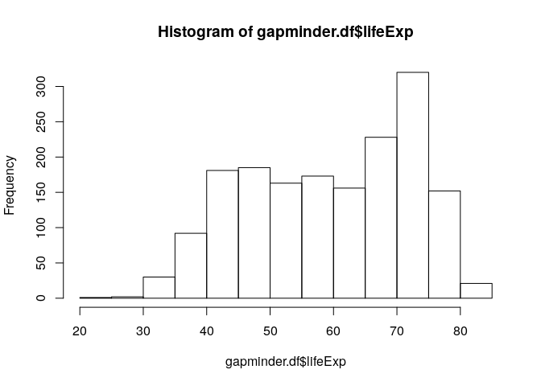

STAT 545 - Assignment 1.2
================
Sean La
09/09/2019

First, we’ll load the Gapminder datatset.

``` r
library(gapminder)
gapminder.df <- gapminder
```

Let’s look at the structure of the Gapminder
    dataset…

``` r
str(gapminder.df)
```

    ## Classes 'tbl_df', 'tbl' and 'data.frame':    1704 obs. of  6 variables:
    ##  $ country  : Factor w/ 142 levels "Afghanistan",..: 1 1 1 1 1 1 1 1 1 1 ...
    ##  $ continent: Factor w/ 5 levels "Africa","Americas",..: 3 3 3 3 3 3 3 3 3 3 ...
    ##  $ year     : int  1952 1957 1962 1967 1972 1977 1982 1987 1992 1997 ...
    ##  $ lifeExp  : num  28.8 30.3 32 34 36.1 ...
    ##  $ pop      : int  8425333 9240934 10267083 11537966 13079460 14880372 12881816 13867957 16317921 22227415 ...
    ##  $ gdpPercap: num  779 821 853 836 740 ...

There’s a column called `lifeExp`, which stands for life expectancy.
Let’s find out what the mean and standard deviations for life
expectancy
are\!

``` r
print(paste('The mean life expectancy is', mean(gapminder.df$lifeExp), '.'))
```

    ## [1] "The mean life expectancy is 59.4744393661972 ."

``` r
print(paste('The standard deviation for life expectancy is', sd(gapminder.df$lifeExp), '.'))
```

    ## [1] "The standard deviation for life expectancy is 12.9171074152412 ."

Let’s make a histogram of the life expectancies to visualize the data
better.

``` r
hist(gapminder.df$lifeExp)
```

<!-- -->
