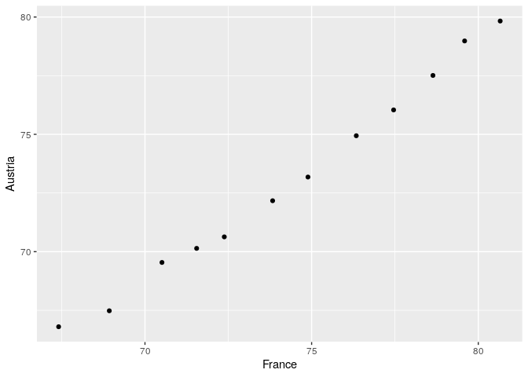
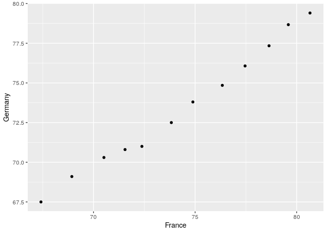

STAT 545A - Assignment 4
================
Sean La
08/10/2019

# Exercise 1

## Univariate Option 1

We’ll work with the `gapminder` dataset for this exercise. We’ll take
the life expectancies of France, Germany, and Austria.

``` r
# This tibble will contain the life expectancies. It will be quite wide.
(wide_life_exp_tbl <- gapminder %>% 
  filter(country %in% c('France','Germany','Austria')) %>% # Select France, Germany, and Austria
  select(country, year, lifeExp) %>% # Select only the columns 'country', 'year', and 'lifeExp', since we don't need the other columns. 
  pivot_wider(id_cols = year,        # Pivot the table to make it wider, each column corresponding to a country, and the entries below the columns
              names_from = country,  # being the life expectancies for each year.
              values_from = lifeExp))
```

    ## # A tibble: 12 x 4
    ##     year Austria France Germany
    ##    <int>   <dbl>  <dbl>   <dbl>
    ##  1  1952    66.8   67.4    67.5
    ##  2  1957    67.5   68.9    69.1
    ##  3  1962    69.5   70.5    70.3
    ##  4  1967    70.1   71.6    70.8
    ##  5  1972    70.6   72.4    71  
    ##  6  1977    72.2   73.8    72.5
    ##  7  1982    73.2   74.9    73.8
    ##  8  1987    74.9   76.3    74.8
    ##  9  1992    76.0   77.5    76.1
    ## 10  1997    77.5   78.6    77.3
    ## 11  2002    79.0   79.6    78.7
    ## 12  2007    79.8   80.7    79.4

Let’s now compare the life expectancies of France versus the other three
countries.

``` r
wide_life_exp_tbl %>% 
  ggplot(aes(x=France,y=Austria)) + # Compare the life expectancies between France and Austria
  geom_point() # Scatterplot it
```

<!-- -->

Each point in the above plot corresponds to every fifth year between
1952 to 2007 inclusive. The x-value of the point is the life expectancy
of France in that year, and the y-value is the life expectancy of
Austria. The points lie roughly on the line \(y=x\), which implies that
Austria and France have had similar life expectancies from 1952 to 2007.
As well, because the points lie on the line \(y = x\), this also implies
that Austria and France have had similar changes in life expectancy from
1952 to 2007.

``` r
wide_life_exp_tbl %>% 
  ggplot(aes(x=France, y=Germany)) + # Compare the life expectancies between France and Germany
  geom_point() # Scatterplot it
```

<!-- -->

This plot looks very similar to the plot between France and Austria’s
life expectancies, so we can also conclude that France and Austria have
had similar life expectancies between 1952 and 2007, as well as similar
increase in life expectancy in that same timeframe.

Let’s now reshape the tibble to be in long format again.

``` r
(long_life_exp_tbl <- wide_life_exp_tbl %>% 
  pivot_longer(cols = c('Austria', 'Germany', 'France'),
               names_to = 'country',
               values_to = 'lifeExp'))
```

    ## # A tibble: 36 x 3
    ##     year country lifeExp
    ##    <int> <chr>     <dbl>
    ##  1  1952 Austria    66.8
    ##  2  1952 Germany    67.5
    ##  3  1952 France     67.4
    ##  4  1957 Austria    67.5
    ##  5  1957 Germany    69.1
    ##  6  1957 France     68.9
    ##  7  1962 Austria    69.5
    ##  8  1962 Germany    70.3
    ##  9  1962 France     70.5
    ## 10  1967 Austria    70.1
    ## # … with 26 more rows

Good as new\!

# Exercise 2

## Multivariate option 2

Let’s make a wide tibble where each row is year, and the columns are
life expectancy and GDP per capita for Iceland and Denmark.

``` r
(wide_multivariate_tbl <- gapminder %>% 
  select(year, country, lifeExp, gdpPercap) %>% # Select the year, country, life expectancy, and GDP per capita columns.
  filter(country %in% c('Iceland', 'Denmark')) %>% 
  pivot_wider(id_cols = year,
              names_from = country,
              names_sep = '_',
              values_from = c(lifeExp, gdpPercap)))
```

    ## # A tibble: 12 x 5
    ##     year lifeExp_Denmark lifeExp_Iceland gdpPercap_Denmark gdpPercap_Icela…
    ##    <int>           <dbl>           <dbl>             <dbl>            <dbl>
    ##  1  1952            70.8            72.5             9692.            7268.
    ##  2  1957            71.8            73.5            11100.            9244.
    ##  3  1962            72.4            73.7            13583.           10350.
    ##  4  1967            73.0            73.7            15937.           13320.
    ##  5  1972            73.5            74.5            18866.           15798.
    ##  6  1977            74.7            76.1            20423.           19655.
    ##  7  1982            74.6            77.0            21688.           23270.
    ##  8  1987            74.8            77.2            25116.           26923.
    ##  9  1992            75.3            78.8            26407.           25144.
    ## 10  1997            76.1            79.0            29804.           28061.
    ## 11  2002            77.2            80.5            32167.           31163.
    ## 12  2007            78.3            81.8            35278.           36181.

Now each column corresponds to the life expectancy or GDP per capita for
either Denmark or Iceland.

Let’s make the tibble longer again, using science\!

``` r
wide_multivariate_tbl %>% 
  pivot_longer(cols = -year,
               names_to = c('.value','country'),
               names_sep = '_')
```

    ## # A tibble: 24 x 4
    ##     year country lifeExp gdpPercap
    ##    <int> <chr>     <dbl>     <dbl>
    ##  1  1952 Denmark    70.8     9692.
    ##  2  1952 Iceland    72.5     7268.
    ##  3  1957 Denmark    71.8    11100.
    ##  4  1957 Iceland    73.5     9244.
    ##  5  1962 Denmark    72.4    13583.
    ##  6  1962 Iceland    73.7    10350.
    ##  7  1967 Denmark    73.0    15937.
    ##  8  1967 Iceland    73.7    13320.
    ##  9  1972 Denmark    73.5    18866.
    ## 10  1972 Iceland    74.5    15798.
    ## # … with 14 more rows

We’ve successfully converted the four columns for life expectancy and
GDP per capita for Iceland and Denmark into three columns.

# Exercise 3

Let’s download the data for this
exercise.

``` r
guest <- read_csv("https://raw.githubusercontent.com/STAT545-UBC/Classroom/master/data/wedding/attend.csv")
email <- read_csv("https://raw.githubusercontent.com/STAT545-UBC/Classroom/master/data/wedding/emails.csv")
```

The `guest` dataset looks like this:

``` r
guest
```

    ## # A tibble: 30 x 7
    ##    party name  meal_wedding meal_brunch attendance_wedd… attendance_brun…
    ##    <dbl> <chr> <chr>        <chr>       <chr>            <chr>           
    ##  1     1 Somm… PENDING      PENDING     PENDING          PENDING         
    ##  2     1 Phil… vegetarian   Menu C      CONFIRMED        CONFIRMED       
    ##  3     1 Blan… chicken      Menu A      CONFIRMED        CONFIRMED       
    ##  4     1 Emaa… PENDING      PENDING     PENDING          PENDING         
    ##  5     2 Blai… chicken      Menu C      CONFIRMED        CONFIRMED       
    ##  6     2 Nige… <NA>         <NA>        CANCELLED        CANCELLED       
    ##  7     3 Sine… PENDING      PENDING     PENDING          PENDING         
    ##  8     4 Ayra… vegetarian   Menu B      PENDING          PENDING         
    ##  9     5 Atla… PENDING      PENDING     PENDING          PENDING         
    ## 10     5 Denz… fish         Menu B      CONFIRMED        CONFIRMED       
    ## # … with 20 more rows, and 1 more variable: attendance_golf <chr>

The `email` dataset looks like so:

``` r
email
```

    ## # A tibble: 14 x 2
    ##    guest                                             email                 
    ##    <chr>                                             <chr>                 
    ##  1 Sommer Medrano, Phillip Medrano, Blanka Medrano,… sommm@gmail.com       
    ##  2 Blair Park, Nigel Webb                            bpark@gmail.com       
    ##  3 Sinead English                                    singlish@hotmail.ca   
    ##  4 Ayra Marks                                        marksa42@gmail.com    
    ##  5 Jolene Welsh, Hayley Booker                       jw1987@hotmail.com    
    ##  6 Amayah Sanford, Erika Foley                       erikaaaaaa@gmail.com  
    ##  7 Ciaron Acosta                                     shining_ciaron@gmail.…
    ##  8 Diana Stuart                                      doodledianastu@gmail.…
    ##  9 Daisy-May Caldwell, Martin Caldwell, Violet Cald… caldwellfamily5212@gm…
    ## 10 Rosanna Bird, Kurtis Frost                        rosy1987b@gmail.com   
    ## 11 Huma Stokes, Samuel Rutledge                      humastokes@gmail.com  
    ## 12 Eddison Collier, Stewart Nicholls                 eddison.collier@gmail…
    ## 13 Turner Jones                                      tjjones12@hotmail.ca  
    ## 14 Albert Marshall, Vivian Marshall                  themarshallfamily1234…

The `email` dataset is kind of inconvenient at the moment in that
several guests are grouped in the same row. Let’s make a row for each
unique
guest.

``` r
# `sep = ', '` indicates that guest names are separated by a comma, followed by a space
(email <- email %>% separate_rows(guest, sep = ', ')) 
```

    ## # A tibble: 28 x 2
    ##    guest           email              
    ##    <chr>           <chr>              
    ##  1 Sommer Medrano  sommm@gmail.com    
    ##  2 Phillip Medrano sommm@gmail.com    
    ##  3 Blanka Medrano  sommm@gmail.com    
    ##  4 Emaan Medrano   sommm@gmail.com    
    ##  5 Blair Park      bpark@gmail.com    
    ##  6 Nigel Webb      bpark@gmail.com    
    ##  7 Sinead English  singlish@hotmail.ca
    ##  8 Ayra Marks      marksa42@gmail.com 
    ##  9 Jolene Welsh    jw1987@hotmail.com 
    ## 10 Hayley Booker   jw1987@hotmail.com 
    ## # … with 18 more rows

That’s better\! Let’s now work with the datasets.

## Exercise 3.1

Let’s add a column corresponding to the email for each guest.

``` r
left_join(guest, email, by=c("name" = "guest"))
```

    ## # A tibble: 30 x 8
    ##    party name  meal_wedding meal_brunch attendance_wedd… attendance_brun…
    ##    <dbl> <chr> <chr>        <chr>       <chr>            <chr>           
    ##  1     1 Somm… PENDING      PENDING     PENDING          PENDING         
    ##  2     1 Phil… vegetarian   Menu C      CONFIRMED        CONFIRMED       
    ##  3     1 Blan… chicken      Menu A      CONFIRMED        CONFIRMED       
    ##  4     1 Emaa… PENDING      PENDING     PENDING          PENDING         
    ##  5     2 Blai… chicken      Menu C      CONFIRMED        CONFIRMED       
    ##  6     2 Nige… <NA>         <NA>        CANCELLED        CANCELLED       
    ##  7     3 Sine… PENDING      PENDING     PENDING          PENDING         
    ##  8     4 Ayra… vegetarian   Menu B      PENDING          PENDING         
    ##  9     5 Atla… PENDING      PENDING     PENDING          PENDING         
    ## 10     5 Denz… fish         Menu B      CONFIRMED        CONFIRMED       
    ## # … with 20 more rows, and 2 more variables: attendance_golf <chr>,
    ## #   email <chr>

Each guest is paired with an email now.

## Exercise 3.2

Let’s find out people who we have emails for, but are not on the
guestlist.

``` r
anti_join(email, guest, by=c('guest' = 'name'))
```

    ## # A tibble: 3 x 2
    ##   guest           email                          
    ##   <chr>           <chr>                          
    ## 1 Turner Jones    tjjones12@hotmail.ca           
    ## 2 Albert Marshall themarshallfamily1234@gmail.com
    ## 3 Vivian Marshall themarshallfamily1234@gmail.com

Turner, Albert, and Vivian are not invited to the wedding\! This will
make for some juicy gossip at the next country club meeting.

## Exercise 3.3

Ah, I forgot we’re not in high school anymore, so we should put everyone
in `email` on the guest list to avoid drama.

``` r
complete_guestlist <- full_join(guest, email, by = c('name' = 'guest'))
```

Let’s confirm that Turner, Albert, and Vivian are indeed on the
guestlist
now.

``` r
complete_guestlist %>% filter(name %in% c('Turner Jones', 'Albert Marshall', 'Vivian Marshall'))
```

    ## # A tibble: 3 x 8
    ##   party name  meal_wedding meal_brunch attendance_wedd… attendance_brun…
    ##   <dbl> <chr> <chr>        <chr>       <chr>            <chr>           
    ## 1    NA Turn… <NA>         <NA>        <NA>             <NA>            
    ## 2    NA Albe… <NA>         <NA>        <NA>             <NA>            
    ## 3    NA Vivi… <NA>         <NA>        <NA>             <NA>            
    ## # … with 2 more variables: attendance_golf <chr>, email <chr>

They’re on the list now\! Perfect.
