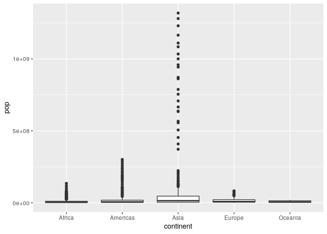
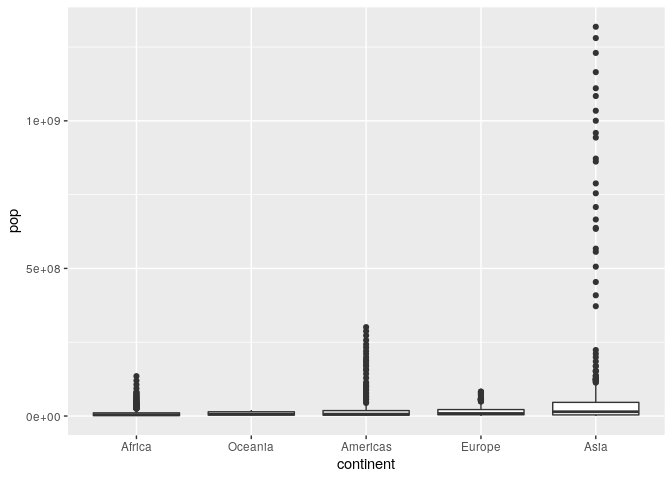
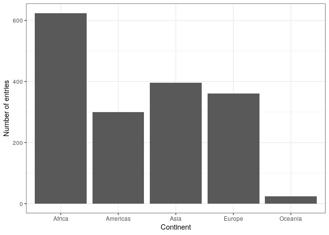
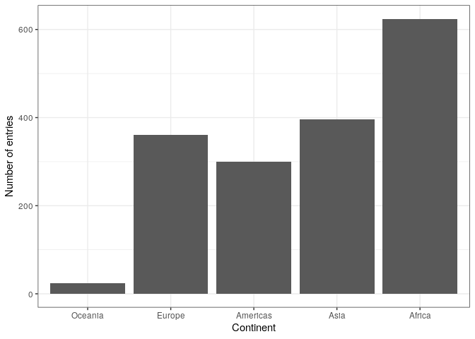
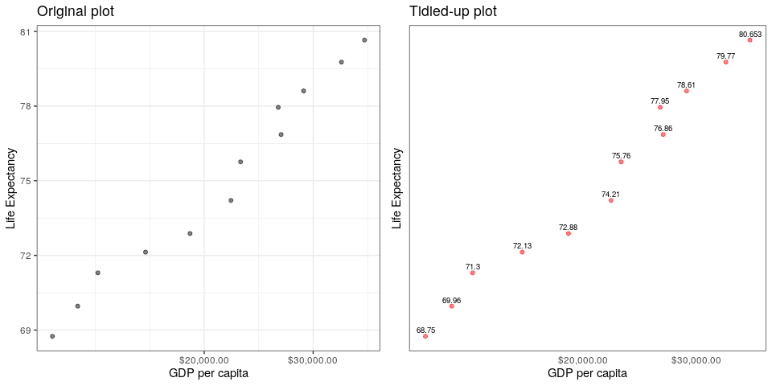
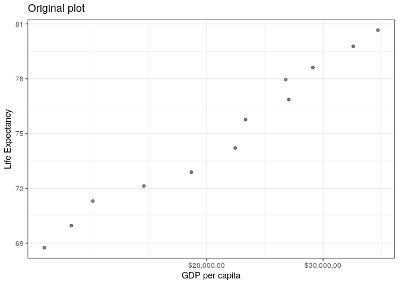
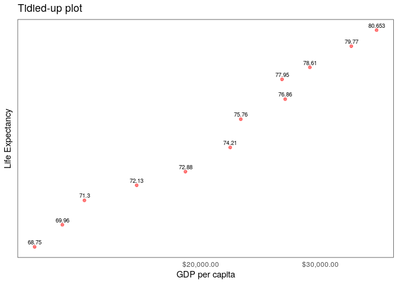

STAT 545 - Assignment 5
================
Sean La
17/10/2019

# Question 1

Using the `here::here` package in R analyses is valuable because it
provides a unified way to reference the root directory of your project
that avoids the common hiccups that occur when working relative paths in
complex project structures and working across both operating systems and
R platforms. The main feature of `here::here` is it automatically
detects the root directory of your project, where it could be the folder
that contains an `.Rproj` file, a `.here` file, a variety of other
files, or simply the current working directory.

First, I’ll discuss why using `here::here` is preferable over using
relative paths in large projects. Often times, when you’re working with
a large dataset, your project folder will have multiple subfolders. If
one of your scripts exists in one subfolder, and you’re trying to refer
to the contents of another subfolder on the same level, you’ll have to
use relative paths such as `../subfolder1/file.txt`. Whereas when you
use `here::here`, you can simply just refer to the file by typing
`here::here('subfolder1','file.txt')`.

As well, `here::here` is compatible across operating systems. When using
R in Windows, the paths use backslashes in their paths, like this:
`C\Users\sean`. In Unix systems such as Unix and OS X, paths use forward
slashes in their paths, like this `/home/seanla/`. `here::here` allows
paths to be cross-compatible across operating systems.

Lastly, `here::here` also allows regular R scripts to work with relative
paths. R scripts don’t work with relative paths, so they will fail if
you try to work with relative paths like this: `../file.txt`. You’ll
have to stick with absolute paths, then. However, `here::here` allows
you to avoid using absolute paths in R scripts.

# Question 2

Let’s figure out how many levels we have in `gapminder$continent`.

``` r
nlevels(gapminder$continent)
```

    ## [1] 5

We have 142 levels.

How many rows do we have?

``` r
nrow(gapminder)
```

    ## [1] 1704

We have 1704 rows.

Let’s now filter out `Oceania` from our dataset.

``` r
gap_sans_oceania <- gapminder %>% filter(continent != 'Oceania')
```

How many rows do we have now?

``` r
nrow(gap_sans_oceania)
```

    ## [1] 1680

1680, less than the number before dropping `Oceania`.

How many factors do we have?

``` r
nlevels(gap_sans_oceania$continent)
```

    ## [1] 5

We stil have 5 continents as factors, which isn’t what we expected\!

Let’s prune out our unused factors.

``` r
gap_sans_oceania <- gap_sans_oceania %>% droplevels()
nlevels(gap_sans_oceania$continent)
```

    ## [1] 4

Now we only have four factors in `gapminder$continent`, which is what we
want\! Perfect.

Let’s look at boxplots of each continents population.

``` r
gapminder %>% 
  ggplot(aes(continent, pop)) + 
  geom_boxplot()
```

<!-- -->

The continent factors seem to be ordered alphabetically. Let’s try
ordering the factors based on their standard deviation of GDP per
capita. If a continent has a higher standard deviation in GDP per
capita, then that means the GDP per capita of the countries inside the
continent are not so consistent.

``` r
gapminder %>% 
  ggplot(aes(continent, pop)) + 
  geom_boxplot(aes(fct_reorder(continent, gdpPercap, sd)))
```

<!-- -->

Let’s quickly confirm that our reordering of the factors based on
standard deviation of GDP per capita actually worked.

``` r
gapminder %>% 
  group_by(continent) %>% 
  summarise(gdpPercap_sd = sd(gdpPercap))
```

    ## # A tibble: 5 x 2
    ##   continent gdpPercap_sd
    ##   <fct>            <dbl>
    ## 1 Africa           2828.
    ## 2 Americas         6397.
    ## 3 Asia            14045.
    ## 4 Europe           9355.
    ## 5 Oceania          6359.

Indeed, we have Africa first, then Oceania, then Americas, Europe, and
then finally Asia. It worked\! Huzzuh\!

# Question 3

Let’s reorder the continents factor in `gapminder` using
`forcats::fct_reorder` in descending order based on each continents’
median life expectancy.

Before we start, this is what the structure of the `gapminder` dataset
looks like
    before:

``` r
str(gapminder)
```

    ## Classes 'tbl_df', 'tbl' and 'data.frame':    1704 obs. of  6 variables:
    ##  $ country  : Factor w/ 142 levels "Afghanistan",..: 1 1 1 1 1 1 1 1 1 1 ...
    ##  $ continent: Factor w/ 5 levels "Africa","Americas",..: 3 3 3 3 3 3 3 3 3 3 ...
    ##  $ year     : int  1952 1957 1962 1967 1972 1977 1982 1987 1992 1997 ...
    ##  $ lifeExp  : num  28.8 30.3 32 34 36.1 ...
    ##  $ pop      : int  8425333 9240934 10267083 11537966 13079460 14880372 12881816 13867957 16317921 22227415 ...
    ##  $ gdpPercap: num  779 821 853 836 740 ...

If we use `arrange` on the original `gapminder` dataset based on the
`continent`, we get this.

``` r
head(arrange(gapminder, continent))
```

    ## # A tibble: 6 x 6
    ##   country continent  year lifeExp      pop gdpPercap
    ##   <fct>   <fct>     <int>   <dbl>    <int>     <dbl>
    ## 1 Algeria Africa     1952    43.1  9279525     2449.
    ## 2 Algeria Africa     1957    45.7 10270856     3014.
    ## 3 Algeria Africa     1962    48.3 11000948     2551.
    ## 4 Algeria Africa     1967    51.4 12760499     3247.
    ## 5 Algeria Africa     1972    54.5 14760787     4183.
    ## 6 Algeria Africa     1977    58.0 17152804     4910.

This is what the corresponding frequency box plot looks like.

``` r
gapminder %>%
  ggplot() +
  geom_bar(aes(continent)) +
  theme_bw() +
  ylab("Number of entries") + xlab("Continent")
```

<!-- -->

This is what it looks like after reordering
continents.

``` r
shuffled_gap <- gapminder %>% transform(continent = fct_reorder(continent, lifeExp, median, .desc=T))
str(shuffled_gap)
```

    ## 'data.frame':    1704 obs. of  6 variables:
    ##  $ country  : Factor w/ 142 levels "Afghanistan",..: 1 1 1 1 1 1 1 1 1 1 ...
    ##  $ continent: Factor w/ 5 levels "Oceania","Europe",..: 4 4 4 4 4 4 4 4 4 4 ...
    ##  $ year     : int  1952 1957 1962 1967 1972 1977 1982 1987 1992 1997 ...
    ##  $ lifeExp  : num  28.8 30.3 32 34 36.1 ...
    ##  $ pop      : int  8425333 9240934 10267083 11537966 13079460 14880372 12881816 13867957 16317921 22227415 ...
    ##  $ gdpPercap: num  779 821 853 836 740 ...

Running `fct_reorder` on the `continent` factor based on each
continents’ median life expectancy in descending order reorders the
continent names in the internal representation of the `gapminder`
dataset.

Let’s run `arrange` on `shuffled_gap` based on `continent` to see how
`fct_reorder` effects the results.

``` r
head(arrange(shuffled_gap, continent))
```

    ##     country continent year lifeExp      pop gdpPercap
    ## 1 Australia   Oceania 1952   69.12  8691212  10039.60
    ## 2 Australia   Oceania 1957   70.33  9712569  10949.65
    ## 3 Australia   Oceania 1962   70.93 10794968  12217.23
    ## 4 Australia   Oceania 1967   71.10 11872264  14526.12
    ## 5 Australia   Oceania 1972   71.93 13177000  16788.63
    ## 6 Australia   Oceania 1977   73.49 14074100  18334.20

Countries whose continent is Oceania comes up first. This is different
from the original `gapminder` dataset, where running `arrange` displays
countries whose continent is Africa first.

The frequency boxplot after reordering looks like this.

``` r
shuffled_gap %>%
  ggplot() +
  geom_bar(aes(continent)) +
  theme_bw() +
  ylab("Number of entries") + xlab("Continent")
```

<!-- -->

The boxes are flipped with respect to the x axis.

Let’s now save our shuffled `gapminder` dataset using `here::here`.

``` r
write_csv(shuffled_gap, path = here::here('hw05', 'shuffled_gap.csv'))
```

Let’s read our shuffled `gapminder` dataset again.

``` r
shuffled_gap <- read_csv(file = here::here('hw05', 'shuffled_gap.csv'))
```

    ## Parsed with column specification:
    ## cols(
    ##   country = col_character(),
    ##   continent = col_character(),
    ##   year = col_double(),
    ##   lifeExp = col_double(),
    ##   pop = col_double(),
    ##   gdpPercap = col_double()
    ## )

Did writing and reading our shuffled `gapminder` dataset preserve the
ordering of the `continent`
    factor?

``` r
str(shuffled_gap)
```

    ## Classes 'spec_tbl_df', 'tbl_df', 'tbl' and 'data.frame': 1704 obs. of  6 variables:
    ##  $ country  : chr  "Afghanistan" "Afghanistan" "Afghanistan" "Afghanistan" ...
    ##  $ continent: chr  "Asia" "Asia" "Asia" "Asia" ...
    ##  $ year     : num  1952 1957 1962 1967 1972 ...
    ##  $ lifeExp  : num  28.8 30.3 32 34 36.1 ...
    ##  $ pop      : num  8425333 9240934 10267083 11537966 13079460 ...
    ##  $ gdpPercap: num  779 821 853 836 740 ...
    ##  - attr(*, "spec")=
    ##   .. cols(
    ##   ..   country = col_character(),
    ##   ..   continent = col_character(),
    ##   ..   year = col_double(),
    ##   ..   lifeExp = col_double(),
    ##   ..   pop = col_double(),
    ##   ..   gdpPercap = col_double()
    ##   .. )

Nope\! R doesn’t even recognize that `continent` is a factor variable
now.

Running `arrange` on `continent` gives this.

``` r
head(arrange(shuffled_gap, continent))
```

    ## # A tibble: 6 x 6
    ##   country continent  year lifeExp      pop gdpPercap
    ##   <chr>   <chr>     <dbl>   <dbl>    <dbl>     <dbl>
    ## 1 Algeria Africa     1952    43.1  9279525     2449.
    ## 2 Algeria Africa     1957    45.7 10270856     3014.
    ## 3 Algeria Africa     1962    48.3 11000948     2551.
    ## 4 Algeria Africa     1967    51.4 12760499     3247.
    ## 5 Algeria Africa     1972    54.5 14760787     4183.
    ## 6 Algeria Africa     1977    58.0 17152804     4910.

Running `arrange` gives the same as it was when we were working with the
original `gapminder` dataset.

Plotting the frequency box plot of our written-and-read `shuffled_gap`
dataset gives this.

``` r
shuffled_gap %>%
  ggplot() +
  geom_bar(aes(continent)) +
  theme_bw() +
  ylab("Number of entries") + xlab("Continent")
```

<!-- -->

It’s back to its default state.

# Question 4

In my assignment 2, I presented the following plot:

``` r
(old_plot <- gapminder %>% 
               filter(country == 'Canada') %>% 
               ggplot(aes(gdpPercap, lifeExp)) +
                 geom_point(alpha = 0.5) +
                 scale_x_log10("GDP per capita", labels = scales::dollar_format()) +
                 theme_bw() +
                 ylab("Life Expectancy") +
                 ggtitle('Original plot'))
```

<!-- -->

In class, we learned that one aspect of effective visualizations is
removing visual clutter. One visual clutter in my previous graph could
be the grid lines, which might take away from the visualization. We
could also remove the y-axis labels, and label each point directly with
its value to emphasize the data. We could also color the points red to
draw the readers’ eyes to the datapoints.

``` r
(new_plot <- gapminder %>% 
               filter(country == 'Canada') %>% 
               ggplot(aes(gdpPercap, lifeExp)) +
                 geom_point(alpha=0.5, color='red') +
                 scale_x_log10("GDP per capita", labels = scales::dollar_format()) +
                 theme_bw() +
                 ylab("Life Expectancy") +
                 theme(panel.grid.major = element_blank(), 
                       panel.grid.minor = element_blank(),
                       axis.line = element_blank(),
                       axis.ticks = element_blank(),
                       axis.text.y = element_blank()) +
                 geom_text(aes(label = lifeExp), hjust=0.5, vjust=-0.6, size=2.5) +
                 ggtitle("Tidied-up plot"))
```

<!-- -->

This looks a lot more clean.

Let’s compare the old plot and the new plot on the same figure.

``` r
plot_grid(old_plot, new_plot)
```

<!-- -->

Our new plot really emphasizes the data now. Without the gridlines, the
viewers eyes are directed to the datapoints. The redness of the
datapoints also helps with this, too. Now that the actual life
expectancies of each datapoint are displayed above, the viewer doesn’t
need to look at the y-axis to get that information. The lack of y-axis
labels also helps with this.

# Question 5

Let’s save our new plot\!

``` r
ggsave(here::here('hw05','exercise_5_plot.png'), width=8)
```

    ## Saving 8 x 5 in image

For posterity, we’ll display it here. 

Let’s save only our tidied-up plot. If we want to use `ggsave` again, we
can’t just call it without specifying the `plot` parameter, because
it’ll just save our side-by-side plot again. Let’s specify the `plot`
parameter directly so we can save our tidied-up plot.

``` r
ggsave(here::here('hw05','tidied_up_plot.png'), plot = new_plot)
```

    ## Saving 7 x 5 in image

Let’s display this one, too.

 Beautiful\!
